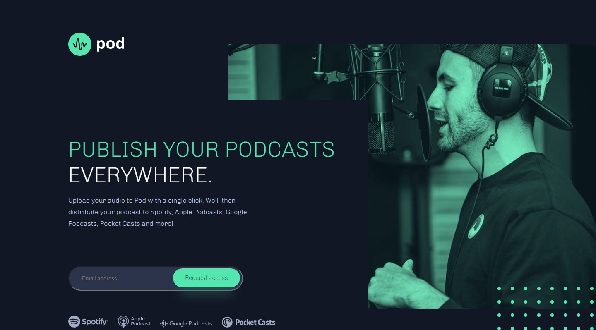

# Pod Request Access Landing Page

## Table of contents

- [Overview](#overview)
  - [The challenge](#the-challenge)
  - [Screenshot](#screenshot)
  - [Links](#links)
- [My process](#my-process)
  - [Built with](#built-with)
  - [What I learned](#what-i-learned)
  - [Continued development](#continued-development)
- [Author](#author)

## Overview

### The challenge

Users should be able to:

- View the optimal layout depending on their device's screen size
- See hover states for interactive elements
- Receive an error message when the form is submitted if:
  - The `Email address` field is empty should show "Email address"
  - The email is not formatted correctly should show "Oops! Please check your email"

### Screenshot

### Links

- Live Site URL: [Pod Access Request](https://podaccess-jason.netlify.app)

## My process

### Built with

- Semantic HTML5 markup
- SASS/SCSS custom properties
- Absolute positioning
- JavaScript

### What I learned

I typically default to using the flexbox to build webpages, but this project was focused more on utilizing absolute positioning for overlays. At first I felt a good approach would be to define each divider with specific heights and widths, but margins seemed to work better here to make the page more responsive.

As I built the project, I could see some problems I would naturally run into due to using absolute positioning. With flexbox, you can simply define boundaries and manipulate the items inside those containers, but that did not work as well here. The next project I complete will be attempted with a mobile first approach. This should allow me to get a better layout that is more responsive accross varying widths. I will most likely design for a minimum width start at 375px and increasing the width ranges from there. That way I can be certain my website will look great when I finish without having any gaps in page responsiveness.

I also used some simple jQuery to show some email validation. The position of the validation messages change position depending on the size of the viewport.

### Continued development

On future projects, I plan on switching from plain css to scss implementation. There are useful tools on VSCode such as Watch Sass which writes scss compilation script as you type. Some may wonder why this is great but it also locates webkit tools needed for making your code compatible across different browsers.
It's also much easier to organize.

## Author

- Website - [Jason Nembhard](https://www.jasonnembhard.com)
- Frontend Mentor - [@jNembhard](https://www.frontendmentor.io/profile/jNembhard)
